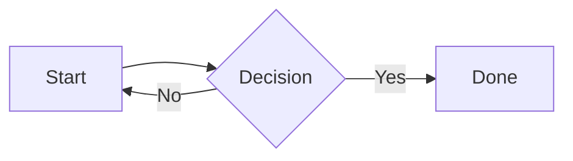

# Mermaid diagrams in MDX and Markdown

## Requirement

Presentation `.mdx` and `.md` files should render fenced ` ```mermaid ` code
blocks as diagrams, so authors can describe flowcharts, sequence diagrams, and
similar visuals with the same syntax they already use in Obsidian or GitHub,
without hand-writing SVG or extra React components.

The diagrams must follow the site's OS-driven light/dark theme
(`prefers-color-scheme`), and the toolchain must stay lightweight: no headless
browser at build time and no JS cost on pages that contain no diagrams.

## How it works

- `astro.config.ts` sets `markdown.syntaxHighlight.excludeLangs` to
  `["mermaid", "math"]`. This is essential: Astro's default Shiki highlighter
  runs before user rehype plugins and would rewrite the ` ```mermaid ` fence
  into highlighted `<span>`s, destroying the `language-mermaid` class before
  `rehypeMermaid` could see it. Excluding `mermaid` leaves the raw
  `<pre><code class="language-mermaid">` intact; `math` keeps Astro's default
  exclusion.
- The whole Markdown pipeline is configured once, in the top-level `markdown`
  config: `remarkPlugins: [remarkObsidianCallouts]` and
  `rehypePlugins: [rehypeMermaid, rehypeMarkdownRendering]` (in that order, so
  `rehypeMermaid` runs first). Astro applies this to `.md`, and `@astrojs/mdx`
  inherits it for `.mdx` because `mdx()` sets no remark/rehype lists of its
  own (when set, `@astrojs/mdx` _replaces_ rather than merges them). The result
  is that `.md` and `.mdx` render identically.
- `src/lib/rehypeMermaid.ts` finds `<pre><code class="language-mermaid">`
  nodes, collects the raw diagram source, and rewrites the `<pre>` into
  `<pre class="mermaid">SOURCE</pre>` — the markup `mermaid.run()` looks for.
  Because the `language-mermaid` code child is removed, the later
  `rehypeMarkdownRendering` pass does not add a misleading `MERMAID` language
  badge (this is why plugin order matters).
- `src/scripts/mermaid.ts` is imported by a `<script>` in
  `src/pages/presentations/[slug].astro`. It only runs on presentation detail
  pages, and it dynamically imports the `mermaid` bundle **only when** at least
  one `pre.mermaid` element is present, so diagram-free pages download no
  Mermaid code.
- The script stashes each diagram's original source in `data-mermaid-src`,
  picks the `dark` or `default` Mermaid theme from
  `matchMedia("(prefers-color-scheme: dark)")`, runs Mermaid, and re-renders
  when the color scheme changes.
- `src/styles/markdown.css` strips the code-block chrome from `pre.mermaid`,
  hides the raw source until Mermaid sets `data-processed`, and keeps the
  source readable if rendering fails (the script adds `.mermaid-fallback`).
  It is imported by `src/styles/global.css` after GitHub Markdown CSS,
  alongside the other Markdown overrides.

## Authoring examples

````mdx

````

Any Mermaid diagram type supported by the bundled Mermaid version works
(flowchart, sequence, class, state, gantt, etc.). No import or component is
needed — the fenced code block is enough.

## Open issues

- Rendering is client-side, so a diagram appears a moment after page load
  while the Mermaid bundle and the diagram itself are processed. This is
  acceptable for the presentation use case; a build-time static-SVG approach
  (`rehype-mermaid` + Playwright) was deliberately rejected to avoid a
  headless-browser build dependency.
- Mermaid, Obsidian callouts, the code-language badge, and the task-list
  checkbox cleanup all work identically in `.mdx` and `.md`, because the
  Markdown pipeline is configured once in the top-level `markdown` config
  (see "How it works"). There is no longer a `.md`/`.mdx` feature gap.
- Mermaid runs with its default `securityLevel` (`strict`), which sanitizes
  diagram-embedded HTML. If a future diagram needs richer HTML labels, the
  `mermaid.initialize` call in `src/scripts/mermaid.ts` is the single place to
  revisit that trade-off.
