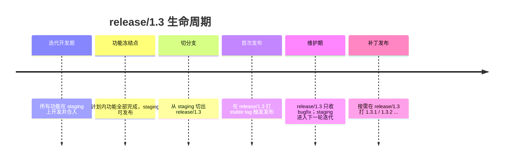
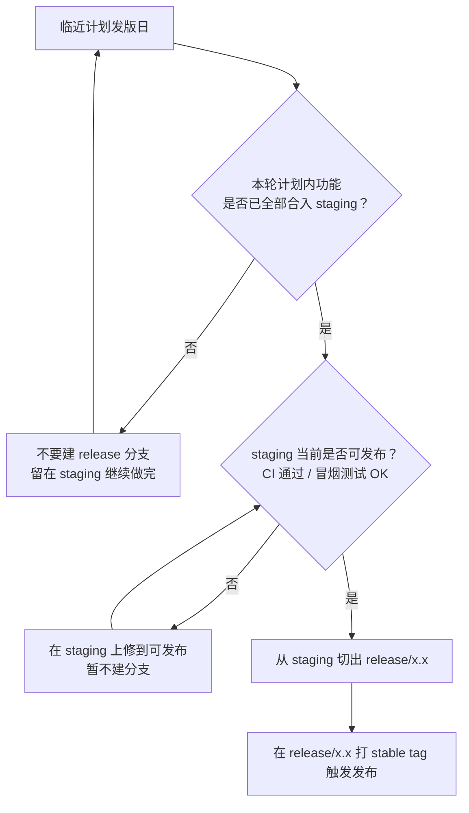
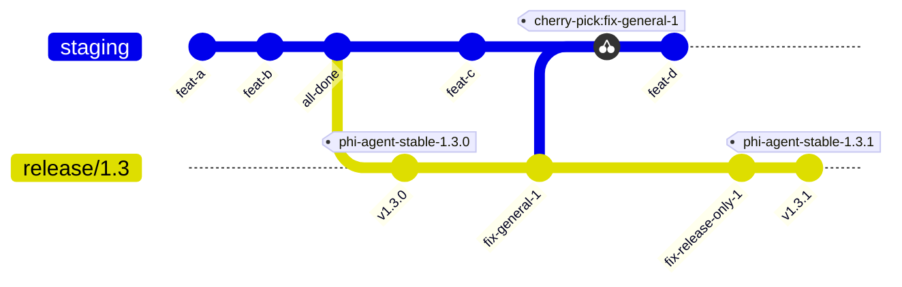
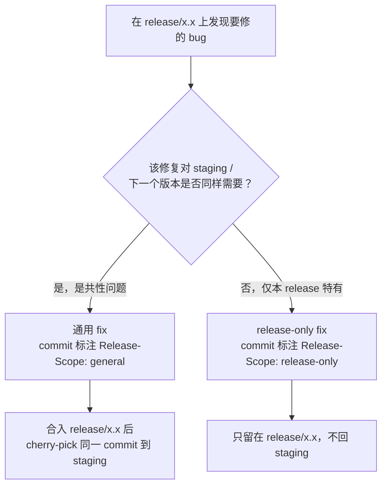
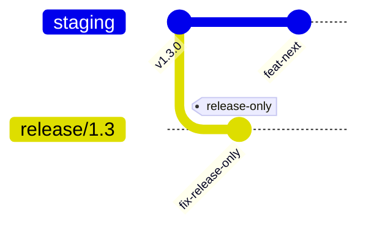
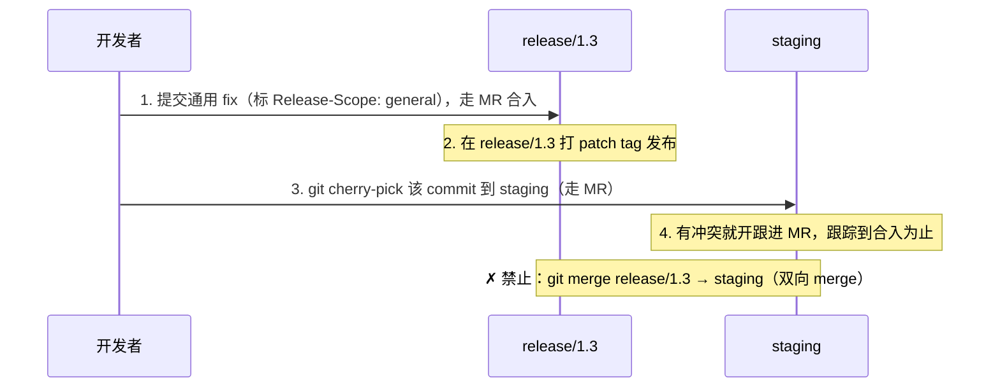

## 这篇文章解决什么问题

`branch-management-strategy.md` 已经定义了目标分支模型
（`main + release/x.y + 手动 tag + 分支保护 + MR + CODEOWNERS`），但它是一份**规则文档**，
没有讲清楚“临近发版那几天，具体每一步该怎么做”。

这篇文章是它的**场景化补充**：把临近发版前后的操作拆成几个细分场景，每个场景配一张
Mermaid 图，并用我们仓库里**真实出现过的混乱提交**做反面对照，目的是统一团队习惯。

### 术语映射：文档里的 `main` = 我们当前的 `staging`

策略文档用 `main` 指代“日常集成分支”。我们仓库现在这条分支仍然叫 `staging`，
暂时不改名。为避免混淆，本文统一写作 **`staging`（即文档中的 `main`）**。
后文所有 `staging` 都指这条日常集成分支。

> [!IMPORTANT]
> 一句话先说结论：临近发版时，**从 `staging` 切出 `release/x.x`**，之后
> `release/x.x` 只收 bugfix，`staging` 继续做下一轮新功能；`release/x.x` 上的每个
> bugfix 都要在 commit message 里标明类型，**通用 fix 用 `cherry-pick` 回 `staging`**，
> **绝不能把 `release/x.x` 整支 merge 回 `staging`**。

---

## 场景 1：什么时候建 release/x.x —— 临近发版才建

`release/x.x` 是**长期维护分支**，一旦建立就要长期承载补丁发布。建得太早，
意味着 `staging` 上还在飞快推进的功能要么进不来、要么被迫往 `release` 里塞，
两边都难受。所以原则是：**临近计划发版日、且功能已冻结时才切分支**。

下面是一个 `release/1.3` 的完整生命周期时间线：



注意：`release/x.x` 用两段式（如 `release/1.3`），具体版本由 tag 表达
（`1.3.0`、`1.3.1`、`1.3.2` 都挂在同一条 `release/1.3` 上）。

---

## 场景 2：建分支的前提 —— 功能必须全部做完

这是最容易被忽略的一步：**只有当本轮计划内功能全部合入 `staging`、且
`staging` 当前可发布时，才允许切 `release/x.x`**。如果还有功能没做完，
就**推迟**建分支，继续在 `staging` 上做，不要为了“赶时间点”提前切。

为什么？提前切分支只会掉进两个坑之一：

- 把半成品功能继续往 `release/x.x` 上塞 —— `release` 不再“稳定”，失去意义；
- 功能留在 `staging`，但 `release` 已切走，这个功能本轮发不出去，还要反复
  cherry-pick 协调，徒增混乱。

用这张决策图判断“现在能不能切分支”：



> [!WARNING]
> “功能没做完就先把分支切了占位”是明确禁止的做法。分支冻结点 = 功能冻结点。

---

## 场景 3：建立之后 —— staging 与 release 双线并行

`release/x.x` 切出来之后，两条线**各干各的，互不阻塞**：

- **`release/x.x`**：只接收 bugfix，按需打补丁版本（`1.3.1`、`1.3.2`…）。
- **`staging`（即文档中的 `main`）**：继续开发**下一轮新功能**，不受发版影响。

关键约束：**新功能永远不进 `release/x.x`**；`release/x.x` 的修复要不要回到
`staging`，取决于场景 4 的判定。下图展示这套并行节奏（图中 `staging`
即文档里的 `main`）：



读图要点：

- `all-done` 之后才切 `release/1.3`（呼应场景 2）。
- `staging` 继续推进 `feat-c`、`feat-d`，**没有任何 feature 流进 `release/1.3`**。
- `release/1.3` 上的 `fix-general-1` 被 **cherry-pick** 回 `staging`（场景 5）。
- `release/1.3` 上的 `fix-release-only-1` **没有**回 `staging`（场景 4A）。
- 补丁通过在 `release/1.3` 打 `1.3.1` tag 发布。

---

## 场景 4：release/x.x 上的 bugfix 分两类，commit message 必须标明

在 `release/x.x` 上修 bug 时，先问一个问题：**这个修复对 `staging`（下一个版本）
是否同样需要？**



### Commit message 标注规范（团队统一约定）

在 `release/x.x` 上的每个 bugfix，commit message 都必须带一行 **`Release-Scope`** 尾注
（trailer），取值只有两个：`general` 或 `release-only`。沿用现有
`type(scope): subject` 的 conventional 风格，trailer 放在 body 末尾。

通用 fix（需要回 `staging`）：

```text
fix(sidecar): avoid overlapping between panels

The panel z-index logic also affects the next release.

Release-Scope: general
```

仅本 release 的 fix（不回 `staging`）：

```text
fix(extension): pin model list to the 1.3 catalog

Only relevant to the 1.3 line; staging already uses the new catalog.

Release-Scope: release-only
```

这样做的直接好处是**可被检索**。临近收尾时，一条命令就能查出
“`release/1.3` 上所有通用 fix”，逐一核对是否都已回 `staging`：

```bash
git log release/1.3 --grep 'Release-Scope: general' --oneline
```

> [!TIP]
> 拿不准是 general 还是 release-only？默认按 **general** 处理并 cherry-pick 回
> `staging` 更安全 —— 漏修下个版本（回归）的代价，远大于多 cherry-pick 一个 commit。

---

## 场景 4A：release-only fix —— 只留在 release/x.x

只对当前发布线有意义的修复（比如锁定某个仅 1.3 使用的模型列表、针对该版本的
临时回滚），标注 `Release-Scope: release-only`，**不回 `staging`**。`staging`
那边可能早就用了新方案，硬 cherry-pick 回去反而引入错误。



`fix-release-only` 只活在 `release/1.3` 上，`staging` 完全不受影响，继续做
`feat-next`。

---

## 场景 5：通用 fix —— 必须 cherry-pick 回 staging

通用 fix 标注 `Release-Scope: general`，在 `release/x.x` 上走 MR 合入、发版之后，
**把同一个 commit `cherry-pick` 回 `staging`**。这样下一个版本不会回归同一个 bug。



操作上就是：

```bash
git switch staging
git switch -c fix/backport-sidecar-overlap
git cherry-pick <release-1.3 上那个 fix 的 commit hash>
# 解决冲突（如有）后，照常开 MR 合回 staging
```

> [!DANGER]
> **绝不能用 `git merge release/1.3` 回 `staging`（双向 merge）来“顺便把修复带回去”。**
> 我们仓库历史里真实出现过 `Merge branch 'staging' into 'release/1.3'` 与
> `Merge branch 'release/1.3' into 'staging'` 来回对冲——这会把 release-only
> 的修复、还有未发布的中间状态一起灌进 `staging`，污染历史、制造回归，也让
> “哪些 fix 回过、哪些没回”彻底查不清。回流**只能**靠 `cherry-pick` 单个 commit。

如果某个通用 fix 一时没法 cherry-pick（冲突大、依赖未就绪），按策略文档的要求
**开一个跟进 MR 并跟踪到合入为止**——在它回到 `staging` 之前，这个 hotfix 不算完成。

---

## 场景 6：真实反面案例对照

下面每一条“错误 ✗”都来自我们 `phi-ai` 仓库近期的真实提交/分支。对照着改。

| 真实现象（✗ 错误）                                                                                                          | ✓ 正确做法                                                                                      |
| --------------------------------------------------------------------------------------------------------------------------- | ----------------------------------------------------------------------------------------------- |
| `Merge branch 'release/1.3' into 'staging'`、`Merge branch 'staging' into 'release/1.3'` 来回双向 merge                     | 修复带 `Release-Scope` 标注；通用 fix 用 `cherry-pick` 单个 commit 回 `staging`，禁止整支 merge |
| commit message 拼写错误：`chroe: bump version`、`bume version to 0.2.67`、`bump ai extensin version`                        | 提交前自检 message；遵循 `type(scope): subject`；让 commit-lint / hook 拦截拼写与格式           |
| 在 feature 分支上提前 bump 版本号，且两个 commit bump 到同一个值（`0.2.65` 重复）                                           | 版本号只在发版流程里随 release/tag 改动，单一权威来源，不在 feature 分支提前 bump               |
| `staging-1`~`staging-5`、`agent/daedalus/0477556f` 等临时分支长期不清理                                                     | `feature/*`、`fix/*`、临时分支合入即删；自动化分支配置过期清理                                  |
| 个人分支 `lex/*` 被当作正式分支反复 merge；`phi-ai-fix-sidebar-tab-id-routing` 与 `fix/sidebar-tab-id-routing` 重复分支并存 | 统一用 `feature/xxx`、`fix/xxx` 前缀，一个改动一条分支，走 MR，合入即删                         |
| `autostash`、`index on staging-2:` 这类内容被误提交进历史                                                                   | `git stash` 内容不要 commit；提交前 `git status` / `git diff --staged` 自查                     |

> [!NOTE]
> 这些不是“个别人的问题”，而是缺少统一约定 + 缺少分支保护/hook 拦截的结果。
> 本文的 `Release-Scope` 标注、cherry-pick 回流、临近发版才切分支，就是把
> 这些约定明确下来。

---

## 速查清单

切 `release/x.x` 之前：

- [ ] 本轮计划内功能已**全部**合入 `staging`
- [ ] `staging` 当前可发布（CI 通过、冒烟测试 OK）
- [ ] 已临近计划发版日（不提前占位切分支）

切出 `release/x.x` 之后，每个 bugfix：

- [ ] 在 `release/x.x` 上走 MR 修复，不直接 push
- [ ] commit message 带 `Release-Scope: general` 或 `Release-Scope: release-only`
- [ ] 通用 fix：合入并发版后 `cherry-pick` 同一 commit 回 `staging`（走 MR）
- [ ] release-only fix：确认 `staging` 确实不需要，**不**回流
- [ ] 没有用 `git merge` 在 `staging` 与 `release/x.x` 之间双向对冲
- [ ] 临近收尾时跑 `git log release/1.3 --grep 'Release-Scope: general'` 核对全部通用 fix 已回 `staging`
- [ ] 合入后删除 `fix/*`、`feature/*`、backport 临时分支

---

## FAQ

**Q：release/x.x 已经切了，才发现有个功能没做完，怎么办？**
A：这正是场景 2 要避免的情况。该功能**不要**塞进 `release/x.x`，留在 `staging`
继续做，等下一个 `release/x.y` 再发；本次只发 `release/x.x` 上已有的、稳定的内容。

**Q：通用 fix 的 cherry-pick 到 `staging` 冲突很大，怎么办？**
A：不要因为图省事就改成整支 merge。按策略文档：开一个跟进 MR，在里面手动适配解决冲突，
跟踪到合入为止。在它回到 `staging` 之前，这个 hotfix 不算完成。

**Q：之前某个通用 fix 忘了标注、也忘了回 `staging`，现在怎么补？**
A：用 `git log release/1.3` 找到那个 commit，确认 `staging` 上确实没有等价修复，
然后照场景 5 正常 `cherry-pick` 回 `staging`（走 MR）。后续提交记得补 `Release-Scope` 标注。

**Q：一定要用 `Release-Scope` 这个 trailer 名吗？**
A：名字可以团队再定，但必须**全队统一且可 `git log --grep` 检索**。本文先以
`Release-Scope: general | release-only` 为准，全文一致使用。
