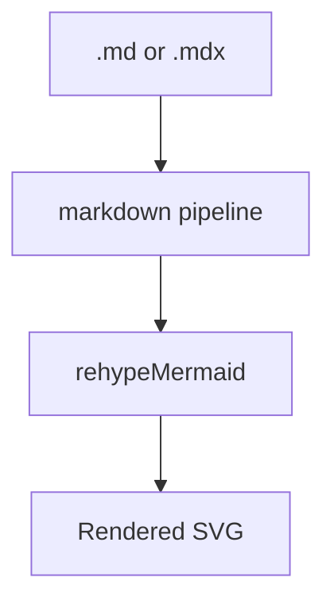

This draft `.md` page confirms that plain Markdown presentations render with
the same pipeline as `.mdx`: Mermaid diagrams, Obsidian callouts, the
code-language badge, and task-list cleanup.

## Mermaid



## Obsidian callout

> [!NOTE]
> Callout syntax works in plain Markdown, not just MDX.

> [!WARNING] Custom title
> Warnings stay readable in light and dark themes.

## Code and task list

```ts
const parity: boolean = true;
```

- [x] Mermaid renders in `.md`
- [x] Callouts render in `.md`
- [ ] Anything else still missing
