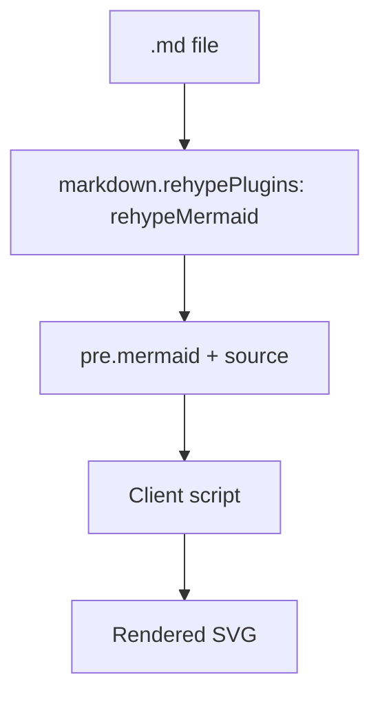

# Mermaid in plain Markdown

This draft `.md` page confirms that fenced `mermaid` code blocks render as
diagrams in plain Markdown presentations, just like in `.mdx`.

Plain Markdown still works around the diagram: **bold**, _italic_, and
`inline code`.
